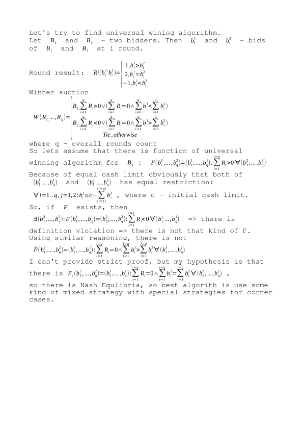

# Theory

## Universal algorithm



## Real world

### General strategy

As mentioned before in general I decided to use mixed strategy. To implement mixed strategy there must be set of pure strategy, e.g
 Overall Median Plus Constant,  Opponent Median Plus Constant, Last winner bid plus Constant, Last opponent bid plus Constant, etc. 

### Corner cases
Besights general strategy there is some very specific corner cases.
#### Single round/Last round
Obviously in this case we are faced with fully determined state, so implementation should decide is there any sense to make
a bid greater than 0
##### Cache limit MU lesser or equal 0.5 X QU (MU deficit)
In this case there will be at least one round with zero bid or every bids will be 1 MU
##### Opponent out of cache
Again, fully determined state, so implementation should decide is there any sense to make
a bid greater than 0
##### Opponents max bids too small
Opponent overall cache n times lesser than mine where n - count of rounds need to win left for 
overall victory

# Practice
I'm not good enough in theory, so main goal of my implementation is provide flexible tool with some basic algorithms and availability for easy extension and combining defferent strategies.

In general there three directions:
* provide some strategies set(pure and corner cases)
* implement [Bidder](src/main/java/auction/Bidder.java) interface with strategies customization support
* try to find better combination of strategies
## Strategies
There are two kinds of strategies:
### Corner Case Strategies:
For some special cases there is set of strategies:
* [CacheDeficitStrategy](src/main/java/auction/strategy/corner/CacheDeficitStrategy.java)    
* [LastRoundStrategy](src/main/java/auction/strategy/corner/LastRoundStrategy.java)    
* [OpponentOutOfCacheStrategy](src/main/java/auction/strategy/corner/OpponentOutOfCacheStrategy.java)    
* [OpponentBidTooSmallStrategy](src/main/java/auction/strategy/corner/OpponentBidTooSmallStrategy.java)    

### Pure Strategies:
For general bids algorithms:
* [LastOpponentBidPlusConstantStrategy](src/main/java/auction/strategy/pure/LastOpponentBidPlusConstantStrategy.java)
* [LastWinnerPlusConstantStrategy](src/main/java/auction/strategy/pure/LastWinnerPlusConstantStrategy.java)
* [MedianPlusConstantStrategy](src/main/java/auction/strategy/pure/MedianPlusConstantStrategy.java)
* [OpponentMedianPlusConstantStrategy](src/main/java/auction/strategy/pure/OpponentMedianPlusConstantStrategy.java)
* [RoundToWinAverageStrategy](src/main/java/auction/strategy/pure/RoundToWinAverageStrategy.java)

Obviously there is some basic set of strategies and it could be improved

## Bidder implementation
There is [AbstractBidder](src/main/java/auction/AbstractBidder.java) implementation of Bidder interface that provide two
important features:
* configure collection of Corner Case Strategies to be applied
* extension point for providing Pure Strategy for general behaviour 

So there is two child of the AbstractBidder to provide Pure strategy based bidder an Mixed Strategy based bidder 

### Winner
[Simple test](src/test/java/auction/utils/Competition.java) produce

* best combination for pure strategy:

```java
  new PureStrategyBidder.Builder()
                                    .withPureStrategy(new LastOpponentBidPlusConstantStrategy(4))
                                    .withDefaultCornerCaseStrategies()
                                    .build();
```

Best delta  may change depends of initial auction values and actually results for delta  4 and 8 are very close

* best combination for mixed strategy is combination of conservative LastOpponentBidPlusConstantStrategy and aggressive
 RoundToWinAverageStrategy:
 
```java   
 new MixedStrategyBidder.Builder()
                                .withPureStrategy(new LastOpponentBidPlusConstantStrategy(2))
                                .withPureStrategy(new LastOpponentBidPlusConstantStrategy(4))
                                .withPureStrategy(new LastOpponentBidPlusConstantStrategy(8))
                                .withPureStrategy(new RoundToWinAverageStrategy())
                                .withDefaultCornerCaseStrategies()
                                .build();
                               
```

Best delta combination may change depends of initial auction values. So besights adding new algorithms one of possible improvement is to provide posibility to choose strategies and params depends on particular auction configuration.
 
